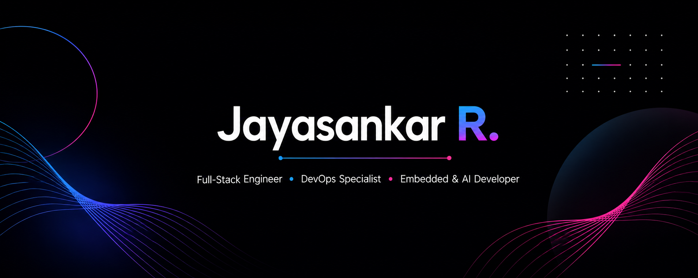

<p align="center">
  
</p>

<h1 align="center">Jayasankar R</h1>

<h3 align="center">
Full-Stack Engineer • DevOps Engineer • AI Builder • Embedded Systems Enthusiast
</h3>

<p align="center">
Building scalable software, cloud-native infrastructure, AI-powered applications, and embedded systems.
</p>

---

## 👨‍💻 About Me

I'm a Software Engineer with 2+ years of professional experience building scalable backend systems, cloud-native platforms, AI-powered applications, and embedded solutions.

My experience spans:

* 🚀 Full-Stack Development
* ☁️ Cloud & DevOps Engineering
* 🤖 AI & RAG Applications
* ⚡ Embedded Systems Development
* 📊 Database Optimization
* 🔄 Distributed Systems & Event-Driven Architecture

I enjoy working across the entire technology stack—from designing APIs and optimizing databases to deploying Kubernetes workloads and building AI-native applications.

---

## 🎯 Current Focus

* AI Agents & Autonomous Workflows
* Retrieval-Augmented Generation (RAG)
* Cloud-Native Infrastructure
* Kubernetes & Platform Engineering
* Distributed Systems
* Event-Driven Architectures
* Embedded & Automotive Software

---

## 🛠️ Tech Stack

### Programming Languages

<p>
  
</p>

### Backend Development

<p>
  
</p>

### Frontend Development

<p>
  
</p>

### Databases

<p>
  
</p>

### Cloud & DevOps

<p>
  
</p>

### Tools & Platforms

<p>
  
</p>

---

## 🚀 Core Expertise

- Backend Engineering (Node.js, Spring Boot)
- Cloud & DevOps (AWS, Kubernetes, ArgoCD)
- AI Applications & RAG Systems
- PostgreSQL Performance Optimization
- Distributed Systems & Event-Driven Architecture
- Embedded Systems & Firmware Development

## 📈 Engineering Interests

```text
Backend Engineering        ████████████████████ 95%
Cloud & DevOps            ██████████████████░ 90%
System Design             █████████████████░░ 85%
AI & RAG Applications     ████████████████░░░ 80%
Frontend Development      ███████████████░░░░ 75%
Embedded Systems          ██████████████░░░░░ 70%
```

---

## 🌱 Currently Learning

* Advanced System Design
* AI Agent Architectures
* Event-Driven Systems
* Automotive Embedded Software
* Cloud-Native Security
* Platform Engineering

---

## 🤝 Open To

* Software Engineering Opportunities
* Backend Engineering Roles
* Platform & DevOps Engineering
* AI Engineering Opportunities
* Open Source Contributions
* Technical Collaborations

---

## 📫 Connect With Me

<p align="left">
<a href="https://github.com/Jayasankar-R">
  
</a>

<a href="https://linkedin.com/in/jayasankar-r-078a65210">
  
</a>

<a href="mailto:jayasankarr.mec@gmail.com">
  
</a>
</p>

---

<p align="center">
  <i>Always learning. Always building. Always curious.</i>
</p>
